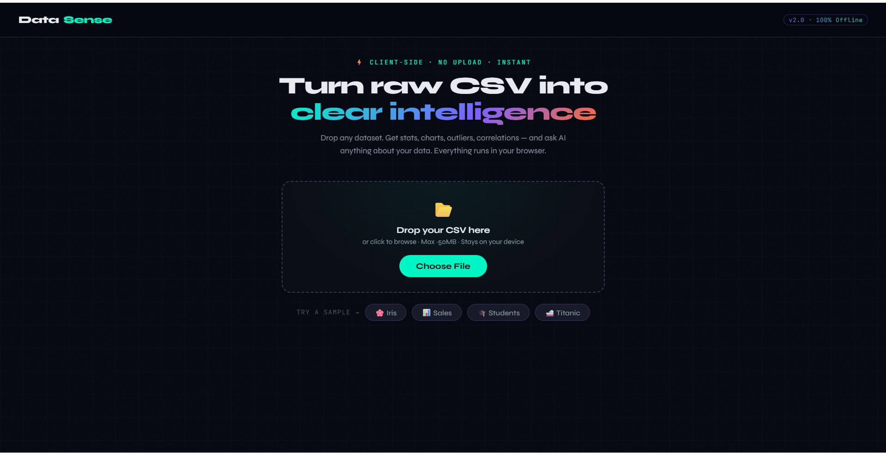
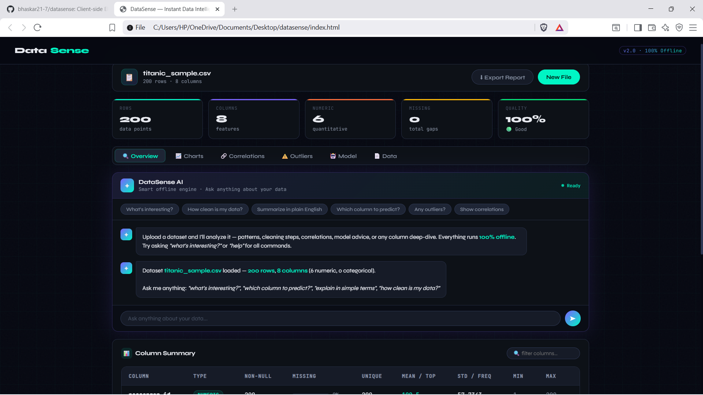
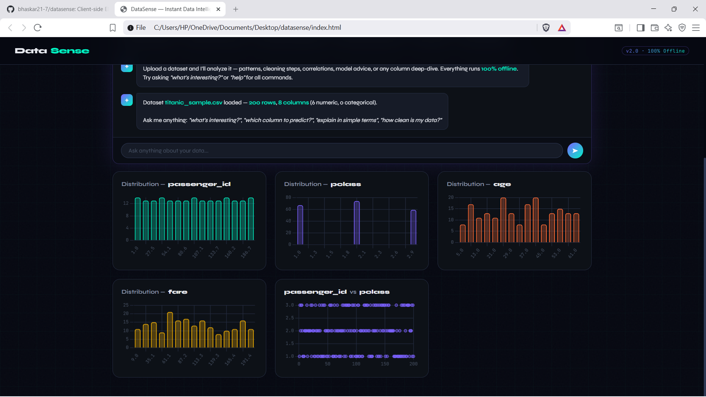
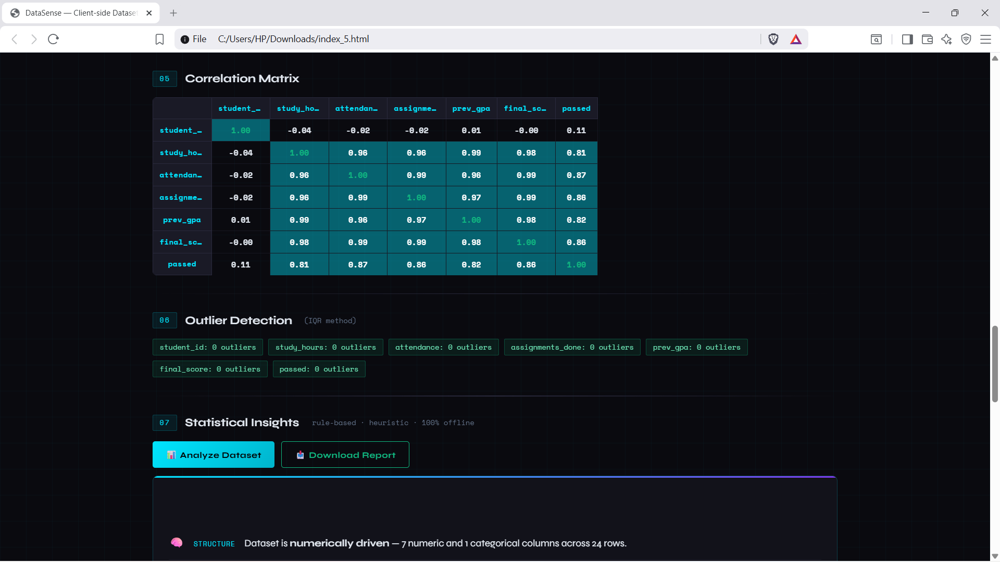

# DataSense — Client-side Dataset Analyzer

> Upload a CSV. Instantly see correlations, outliers, distributions and a baseline model — no code, no cloud, no install.

[](https://bhaskar21-7.github.io/datasense)
[](https://bhaskar21-7.github.io/datasense)
[](#)

---

## ✦ Preview

<table>
  <tr>
    <td></td>
    <td></td>
  </tr>
  <tr>
    <td align="center"><sub>Drop any CSV — sample datasets included</sub></td>
    <td align="center"><sub>Instant dataset overview + scrollable data preview</sub></td>
  </tr>
  <tr>
    <td></td>
    <td></td>
  </tr>
  <tr>
    <td align="center"><sub>Auto-generated histograms, scatter plots & frequency charts</sub></td>
    <td align="center"><sub>Color-coded Pearson correlation matrix</sub></td>
  </tr>
  
</table>

---

## What it does

Drop any CSV file and DataSense runs a full exploratory data analysis in your browser — no server, no API key, no data upload.

**→ [Try the live demo](https://bhaskar21-7.github.io/datasense)**

---

## Features

**EDA (core strength)**
- Dataset overview — shape, types, missing value count
- Column-level stats — mean, std, min/max, median, IQR
- Correlation matrix — row-aligned Pearson r, color-coded heatmap
- Outlier detection — IQR method, flagged per column
- Distributions — auto-binned histograms (√n rule), scatter plots, frequency charts
- Key Finding — auto-surfaces the single most important pattern in your data

**Statistical Insights** *(rule-based, 100% offline)*
- Missing value analysis with imputation recommendations
- Multicollinearity detection (|r| ≥ 0.90 pairs)
- Variance driver — identifies the column dominating data spread
- Skewness flags with transformation suggestions (log, √)
- High-cardinality column detection
- Binary column classification target suggestions
- Full preprocessing pipeline recommendation

**Baseline Model** *(for quick benchmarking)*
- Auto-detects classification vs regression from target column
- Classification → k-Nearest Neighbors (k=5)
- Regression → Linear Regression (gradient descent, 200 epochs)
- StandardScaler fit on training set only — no data leakage
- Deterministic train/test split — same result every run
- Feature correlation with target (with honest disclaimer)
- Categorical columns excluded explicitly with note

**Export**
- Download full analysis as `.txt` report

---

## Tech stack

```
CSV parsing    →  PapaParse
Charts         →  Chart.js
ML             →  Vanilla JS (implemented from scratch)
Stats          →  Rule-based engine (no external dependencies)
Deploy         →  GitHub Pages
```

Zero backend. Zero dependencies to install. Everything runs client-side.

---

## Try it in 10 seconds

1. Open the [live demo](https://bhaskar21-7.github.io/datasense)
2. Sales data loads automatically — full analysis is instant
3. Or drop your own CSV / click a sample chip

**Built-in samples:** 🌸 Iris · 📊 Sales · 🎓 Students

---

## Run locally

```bash
git clone https://github.com/bhaskar21-7/datasense
cd datasense
# open index.html in any browser
```

No build step. No npm install. One file.

---

## What it's not

- Not an AI tool — insights are statistical and rule-based
- Not a production ML system — the model section is a quick baseline, not a deployment pipeline
- Not a data storage service — your files never leave your browser

---

## Roadmap

- [ ] Excel (.xlsx) support
- [ ] PDF export of full report
- [ ] Additional baseline models (Naive Bayes, Decision Tree)
- [ ] Natural language column querying

---

## Built by

**Bhaskar Jha** — Statistics undergraduate, MS 2027

[](https://github.com/bhaskar21-7)

---

*If this saved you time, a ⭐ helps others find it.*
